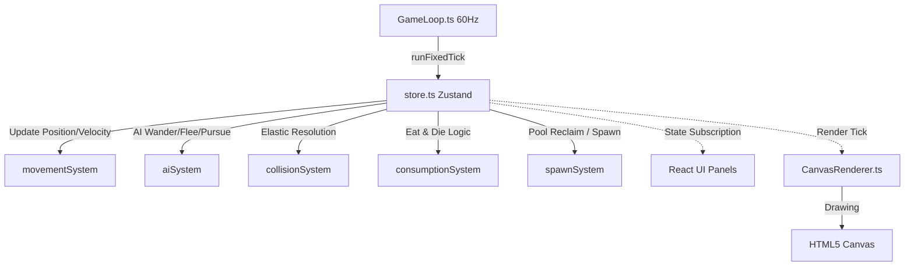

# Leviathan: Apex (深海巨噬)

一款基于 Web 的 2D 俯视角深海生存吞噬进化游戏。玩家从最微小的浮游生物起步，在危机四伏的深海世界中通过吞噬更小的海底生物来壮大自身质量，并在满足升级阈值时选择特定的突变基因进行进化，最终成长为深海食物链顶端的终极巨兽。

---

## 🎮 游戏核心玩法与机制

1. **掠食与生存**：
   * **大鱼吃小鱼**：游戏严格遵循质量与半径公式 $Radius = \sqrt{Mass / \pi}$，玩家只能吞噬半径比自己小的实体。
   * **致命威胁**：大型掠食者（Predator）对玩家具有致命威胁，当玩家半径小于其 $77\%$ 时会被瞬间咬死。
   * **动态难度**：随着玩家等级提升，掠食者（Predator）的数量将从初始的 1 只增多至最高 16 只，且其基础移动速度与感知视野会同步增强。

2. **操作说明**：
   * **日常游动**：通过鼠标移动控制方向，角色将平滑地转向并游向指针位置。
   * **冲刺加速**：按住 **鼠标左键** 或 **空格键** 触发，速度提升至 $1.8$ 倍。冲刺在非狂热状态下每秒会消耗当前总质量的 $2\%$，消耗的质量以身后排出的水泡尾迹形式展现。
   * **主动技能**：按 **鼠标右键** 或 **Q 键** 释放（需在突变中选择「深渊墨汁」后解锁），释放一团致盲黑障，冷却时间为 10 秒。
   * **开发者作弊键**：在开发/测试模式下，按 **L 键** 可直接增重至下一升级阈值。

3. **突变基因进化与难度陡增曲线**：
   * **渐进式升级难度**：升级阈值公式为 $T(n) = T(n-1) \times (2.0 + 0.25n)$，每级所需质量呈指数级增长。Lvl 0 ➔ 1 需吃约 17 个微生物（约 2 分钟），Lvl 1 ➔ 2 需约 44 个微生物（约 2~3 分钟），Lvl 2 ➔ 3 起需大量捕食猎物鱼（约 3 分钟），后期越来越需要持续猎食。食物密度也随等级动态调整：初始微观阶段浮游生物较稀疏（30~40 只），升至稚鱼后逐步提升至 60 只。
   * 每次质量积累达到升级阈值时，游戏暂停并随机弹出 3 张突变基因卡供玩家选择。卡牌基于配置权重概率抽取，目前包含：
     * **骨化重甲 (mut_shield)**：获得一层骨盾，抵御一次致命撕咬，破裂后提供 1 秒无敌并弹开掠食者。
     * **深渊巨口 (mut_engulf)**：吞噬判定半径 $+20\%$。
     * **涡轮尾鳍 (mut_fin)**：基础移动速度 $+15\%$。
     * **高效消化 (mut_efficient_gut)**：吞噬质量转化率 $+10\%$。
     * **连击守护 (mut_combo_guard)**：连击判定衰减延迟由 3 秒延长至 5 秒。
     * **狂热延续 (mut_frenzy_extend)**：狂热持续时间由 5 秒延长至 7 秒。
     * **侧线感知 (mut_perception)**：顶级掠食者对玩家的感知范围 $-15\%$。
     * **涡轮增压 (mut_dash_regen)**：冲刺时的质量消耗率 $-30\%$。
     * **深渊墨汁 (mut_ink)**：[主动技能] 允许释放致盲墨汁黑障，其中的掠食者失去追踪目标并退回 Wander，所有进入其中的 AI 移动速度减半，持续 5 秒，冷却 10 秒。

4. **连击与狂热系统**：
   * 进食可累加连击（Combo），最高 15 层。
   * 叠满 15 层连击后自动进入 **狂热模式 (Frenzy Mode)**：维持 5~7 秒，移速翻倍，吞噬半径提高 $1.5$ 倍，且冲刺不再消耗自身质量。

5. **环境道具与状态效果系统**：
   * 在视口外的边缘区域会定期生成漂移的道具实体（同屏上限 3 个，每 5 秒生成一个），吞噬后可获得增益效果：
     * **磁铁 (Magnet)**：激活磁力吸入增益，持续 10 秒。在磁吸范围内，所有 Plankton 和 Prey 会受到强大的引力拉向玩家。
     * **冰冻 (Freeze)**：瞬间冻结全屏 AI 生物（除了道具实体），持续 5 秒。被冻结的生物速度归零且不再执行 AI 决策。
     * **气泡护盾 (Shield)**：获得一个常驻的气泡护盾，可抵御一次致命伤害。当受到致命攻击时，气泡护盾会被优先扣除（优先于“骨化重甲”），扣除后提供 1.5 秒无敌并将掠食者弹开，极大地增加了生存容错。

---

## 🎨 程序化视觉与逼真动画系统

项目采用 HTML5 Canvas 2D 进行纯程序化动态绘制（零外部图片），提供极高的性能和深度流畅的动画质感：

1. **多品种鱼类生态（17 个视觉变体）**：
   * **Plankton (浮游生物)**：月光水母（带漂浮触手）、磷光虾（带触须与微动作弯体）、夜光藻（脉动发光团）。
   * **Prey (温和猎物)**：小丑鱼（橙色横条纹）、蓝唐王鱼（蓝色渐变体）、神仙鱼（扁平紫带）、霓虹灯鱼（青蓝荧光）、斑马鱼（流线型横纹）。
   * **Competitor (中型竞争者)**：鲈鱼（银灰斑点）、鲷鱼（粉红渐变）、石斑鱼（褐色多斑）、梭鱼（细长暗纹）。
   * **Predator (大型掠食者)**：深海鲨（庞大体型+三角形尖牙）、巨梭（青绿长体+极速尾摆）、琵琶鱼（带摆动长柄的生物发光诱饵灯）、变色巨乌贼（拥有隐形伪装伪装色，距离较远时几乎完全隐身，靠近或进入追击状态时才显形）、冲撞剑鱼（具有高频极速的直线突刺技能，冲撞完毕后进入 1.5 秒眩晕脱力状态）。
   * **Player (进化巨兽)**：玩家扮演的金色巅峰巨兽，体型随等级膨胀并展现出五个核心阶段的递进发育：
     * **Lvl 0~1 孢子小蝌蚪**：圆球头加左右摆动细尾，眼大呆萌，身周笼罩着朦胧的暖金发光护罩。
     * **Lvl 2~3 稚鱼苗**：体型伸展拉长，开启左右摇摆的流线型鱼尾（S型正弦波动）；Lvl 3 开启常驻金黄外溢呼吸光晕；此阶段尚无背鳍与胸鳍。
     * **Lvl 4~5 青年期**：发育出完整的背鳍和划水胸鳍，体表浮现出浅金色物种斑纹，眼睛进化为写实的双白点高光渐变虹膜。
     * **Lvl 6~7 掠食巨兽**：各鱼鳍内部长出白亮的放射状骨刺，侧线系统彻底闭合（淡白色虚线侧线），身体中央浮现发光脉动亮线，张嘴时露出尖锐的獠牙。
     * **Lvl 8+ 终极利维坦**：全身覆盖片片分明、金光闪耀的瓦片黄金龙鳞，腹部生出平衡重力的后副鳍，移动时尾部排放极光拖尾微粒轨迹。
     * **临时演化特征**：激活 **磁铁** 时额外增生红蓝极性发光的磁感须；激活 **气泡护盾** 时体表覆甲并笼罩反光气泡。

2. **高级游泳 Locomotion**：
   * **S 型身体波动**：采用分段相位差的正弦算法，鱼体从头到尾表现出逼真的 S 型流线波动，摆动频率与移速成正比。
   * **胸鳍与尾鳍细节**：胸鳍带微小划水动作以辅助平衡，尾鳍（支持叉形、月牙、扇形、飘逸四种形态）随动作高频摆动。

3. **逼真吞噬动效**：
   * **张嘴动画**：吞食的 250ms 瞬时，鱼嘴物理张开，上下颌分离，掠食者与玩家张嘴时露出尖利牙齿。
   * **挣扎与吸入**：被吞下的鱼以 `eaten_prey` 粒子形态缩水，在吸向玩家巨口的过程中表现出高频挣扎与急促尾摆。
   * **吞食爆汁**：爆汁粒子颜色不再是单一配色，而是会读取被吃鱼的特定品种主色进行融合渲染。

---

## 🛠️ 项目架构设计

项目采用严格的无头状态模拟（Headless Game Engine）与 React 渲染解耦的设计思想：



### 目录结构规范

* **`src/engine/` — 核心逻辑与物理层**：
  * [types.ts](file:///c:/projects/apex/src/engine/types.ts)：逻辑与状态对象的 TypeScript 类型定义。
  * [store.ts](file:///c:/projects/apex/src/engine/store.ts)：全局状态容器（Zustand Vanilla），隔离了 React 生命周期。
  * [spatialHash.ts](file:///c:/projects/apex/src/engine/spatialHash.ts)：空间哈希网格实现，用于 $O(n)$ 快速临近查询。
  * [entityPool.ts](file:///c:/projects/apex/src/engine/entityPool.ts)：通用对象池，回收 AI 实体与粒子，避免运行中分配内存触发 GC。
  * **`src/engine/systems/` — ECS 系统调度**：
    * `movementSystem.ts`：处理惯性位移、冲刺尾迹及空间哈希位置更新。
    * `aiSystem.ts`：处理各种类型 AI 实体的状态机转移和行为。
    * `collisionSystem.ts`：负责实体间的弹性碰撞解算，防止相互穿透。
    * `consumptionSystem.ts`：执行从小到大的吞噬判定、质量累加与死亡清算。
    * `spawnSystem.ts`：管理视野外的生态平衡补充与超限回收。
    * `cameraSystem.ts`：平滑追随玩家世界坐标，自适应动态缩放视口。
* **`src/render/` — 纯 Canvas 渲染层**：
  * [drawEntity.ts](file:///c:/projects/apex/src/render/drawEntity.ts)：鱼身贝塞尔路径构建、花纹裁剪、状态发光和各种细节装饰。
  * [fishSpecies.ts](file:///c:/projects/apex/src/render/fishSpecies.ts)：存储 16 种深海鱼类的视觉样式属性。
  * [drawBackground.ts](file:///c:/projects/apex/src/render/drawBackground.ts)：利用视差滚动绘制具有 3D 深度感的深海星光与海水漂移。
  * [drawParticles.ts](file:///c:/projects/apex/src/render/drawParticles.ts)：爆发粒子、水泡尾迹、骨盾破裂及吸食挣扎动画。
* **`src/ui/` — React UI 交互面板**：
  * `HUD.tsx`：显示左侧等阶质量面板与右侧生存数据面板。
  * `StartScreen.tsx` / `GameOverScreen.tsx`：游戏的开始与结算界面。
  * `EvolutionCardModal.tsx`：升级选择突变基因的三选一弹窗。

---

## ⚡ 性能优化机制

* **空间哈希加速 (Spatial Hash Grid)**：碰撞和吞噬只在周围几个网格单元中查询临近实体，杜绝了多实体时平方级计算量开销。
* **GC 垃圾回收最小化**：
  * 全局使用 `EntityPool` 回收利用对象，游戏运行中没有频繁的 `new` 操作。
  * 主渲染管道中仅创建一次鱼身 `Path2D` 路径，重复供给主体绘制和花纹裁剪，极大地减少了内存分配。
  * 碰撞检测和渲染移除 `Array.from` 及昂贵的 `Map` 转数组行为，改用直接迭代器遍历。
* ** shadowBlur 开销控制**：浮游生物去除了昂贵的模糊阴影绘制，仅在大型掠食者和高阶玩家上使用模糊，低端设备也能满帧运行。

---

## 🚀 快速开始

### 1. 安装依赖

```bash
npm install
```

### 2. 运行本地开发服务

```bash
npm run dev
```

启动后可在浏览器打开 `http://localhost:3000/` 游玩。

### 3. 项目编译构建

```bash
npm run build
```

编译生成的产品包将输出在 `dist/` 文件夹下。
